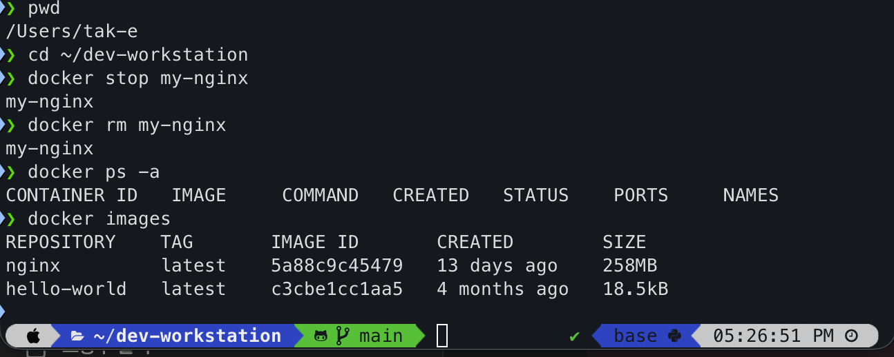
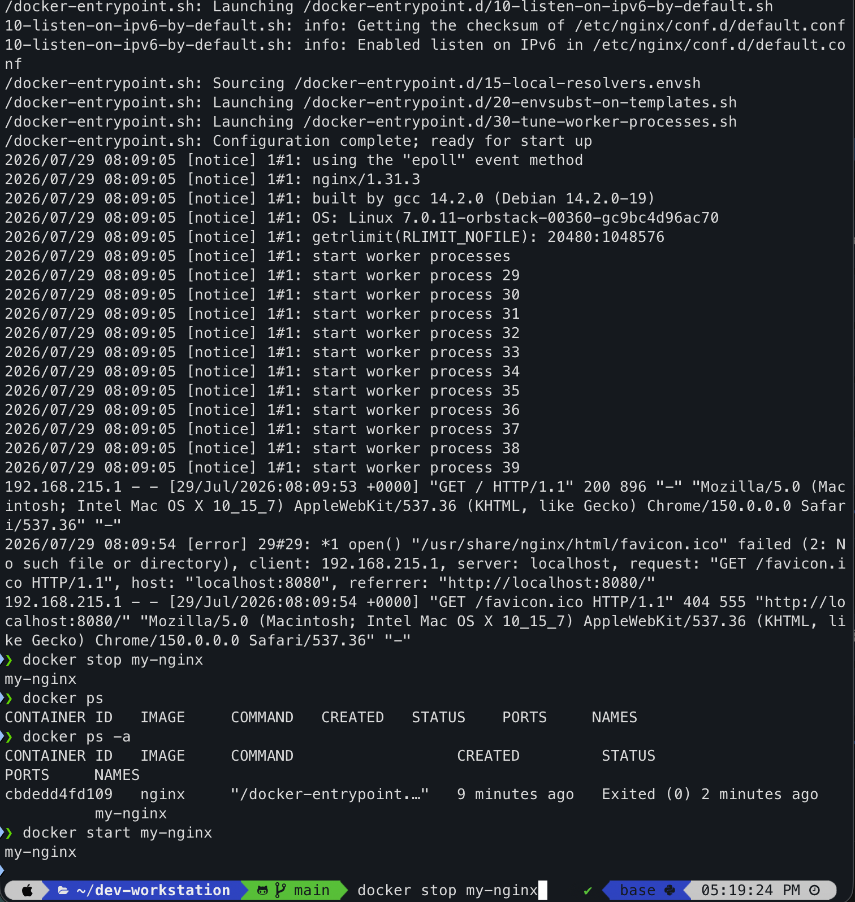
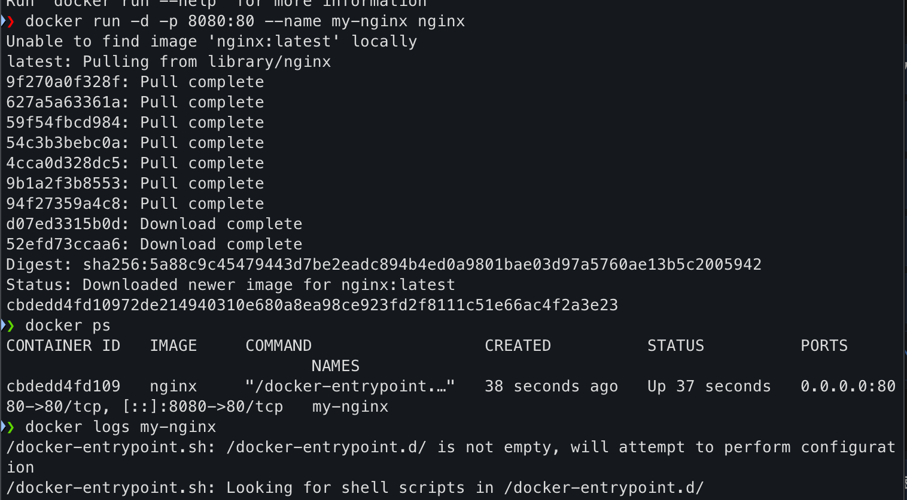
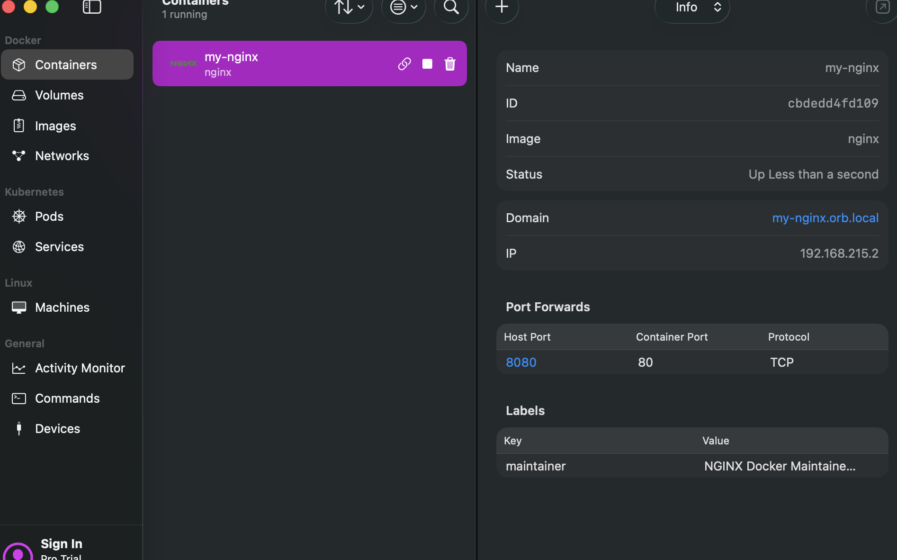
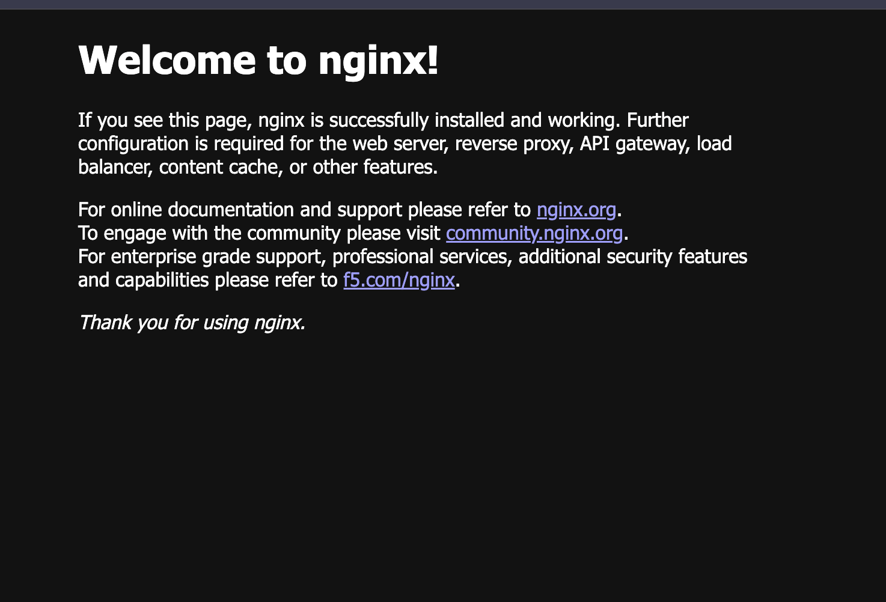
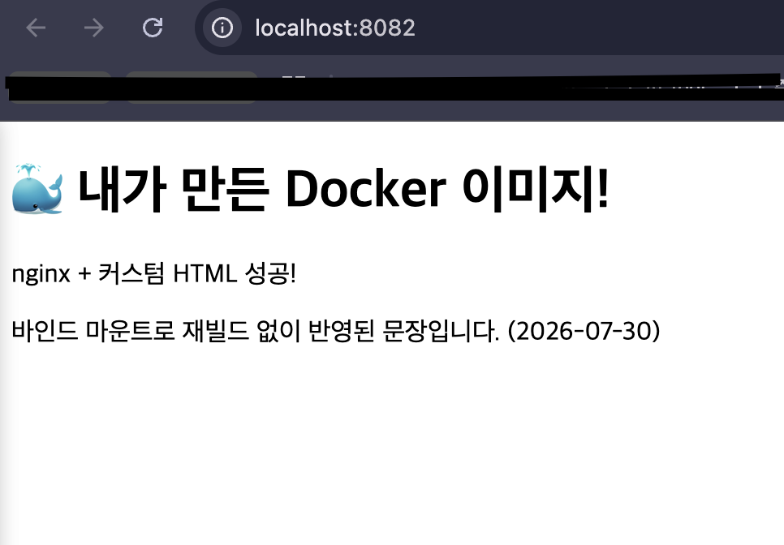
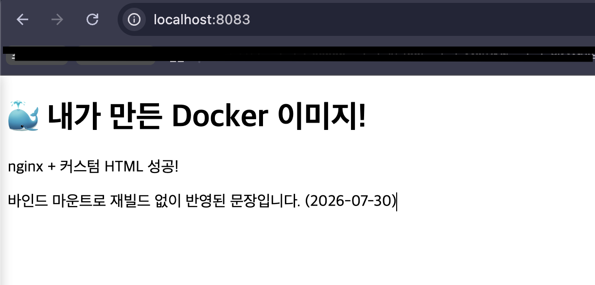

# 개발 워크스테이션 구축

> 터미널(CLI) · Docker(컨테이너) · Git/GitHub 를 직접 손으로 세팅하고,
> **실행 결과(로그 / 접속 / 데이터 유지)로 검증한** 개발 워크스테이션 구축 기록입니다.

- **제출 저장소**: https://github.com/Dong-tak/dev-workstation (Public)
- **원본 로그 파일**: [`logs/`](logs/) — 본 문서의 모든 코드블록은 이 디렉토리의 실제 실행 로그에서 발췌했습니다.
- **실습 캡처 이미지**: [`docs/screenshots/`](docs/screenshots/) — 명령어 입력과 출력이 함께 보이도록 캡처했습니다.

### 디렉토리 구조

```
dev-workstation/
├── README.md                  # 기술 문서 (이 파일)
├── .gitignore
├── my-web/                    # 제출용 웹 서버 컨테이너
│   ├── index.html             # 웹 서버 소스코드(정적 콘텐츠)
│   ├── Dockerfile             # 커스텀 이미지 정의
│   └── docker-compose.yml     # 보너스: 멀티 컨테이너 구성
├── docker-practice/
│   └── Dockerfile             # 최초 실습(베이스 이미지만 지정)
├── docs/screenshots/          # 실습 과정 캡처 이미지
│   ├── 01-orbstack-port-forward.png
│   ├── 02-docker-run-port-mapping.png
│   ├── 03-nginx-default-page.png
│   ├── 04-docker-logs-lifecycle.png
│   ├── 05-cleanup-and-images.png
│   ├── 06-browser-8082-with-urlbar.png
│   └── 07-browser-8083-with-urlbar.png
└── logs/                      # 명령어 + 출력이 함께 기록된 원본 로그
    ├── 01-terminal-basics.log
    ├── 02-permissions.log
    ├── 03-docker-check.log
    ├── 04-container-lifecycle.log
    ├── 05-build-and-port.log
    ├── 05b-rebuild-health.log
    ├── 06-bind-mount.log
    ├── 07-volume.log
    ├── 08-git-config.log
    ├── 09-compose.log
    └── 10-troubleshooting.log
```

---

## 1. 프로젝트 개요

코드가 "내 컴퓨터에서만" 돌아가는 문제를 줄이고, 누구나 같은 방식으로 실행·배포·디버깅할 수 있는 환경을 만드는 것이 목표입니다.

이 과제에서 수행한 것은 다음 4단계입니다.

1. **터미널**로 작업 디렉토리를 만들고 파일 권한을 정리한다.
2. **Docker**를 설치·점검하고 컨테이너를 실행/관리한다.
3. 간단한 웹 서버를 **Dockerfile로 컨테이너화**하고, **포트 매핑**으로 접속을 확인하며,
   **바인드 마운트**로 "변경 반영"을, **볼륨**으로 "데이터 영속성"을 직접 검증한다.
4. **Git/GitHub**로 모든 산출물을 버전 관리하고 원격 저장소에 공유한다.

핵심은 "따라 친 실습"이 아니라 **재현 가능한 환경을 만드는 사고방식**입니다.
그래서 이 문서의 모든 항목은 `명령어 + 출력 결과` 쌍으로 증거를 남겼습니다.

---

## 2. 실행 환경

| 항목 | 값 |
|---|---|
| OS | macOS 26.5 (Build 25F71), Apple Silicon (arm64) |
| Shell | zsh (`/bin/zsh`) |
| 터미널 | macOS 터미널 / VSCode 통합 터미널 |
| Docker Client | 28.4.0 (build d8eb465f86) |
| Docker Server(Engine) | 29.4.0 (linux/arm64) — OrbStack 제공 |
| Docker Compose | v5.1.2 |
| 컨테이너 런타임 | OrbStack 2.2.1 (`docker context = orbstack`) |
| Git | 2.50.1 (Apple Git-155) |

> **OrbStack을 사용한 이유**: 서울캠퍼스 환경은 보안 정책상 `sudo` 사용이 제한될 수 있어
> Docker 데몬을 직접 설치·제어하기 어렵습니다. OrbStack은 앱을 실행하면 내부적으로 Docker 엔진이 함께
> 구동되어 `sudo` 없이도 `docker run`, `docker ps`, `docker build` 를 그대로 사용할 수 있습니다.

---

## 3. 수행 항목 체크리스트

- [x] 터미널 기본 조작 및 폴더 구성 (위치/목록/이동/생성/복사/이름변경/삭제/내용확인/빈 파일)
- [x] 절대 경로 · 상대 경로 비교 실습
- [x] 권한 확인/변경 실습 — 파일 1개 + 디렉토리 1개, 변경 전/후 비교
- [x] Docker 설치 및 데몬 점검 (`docker --version`, `docker info`)
- [x] Docker 기본 운영 명령 (`images` / `ps` / `ps -a` / `logs` / `stats`)
- [x] `hello-world` 실행
- [x] `ubuntu` 컨테이너 내부 진입 + 종료/유지(attach vs exec) 차이 정리
- [x] 기존 베이스 이미지 기반 커스텀 이미지 빌드/실행 (Dockerfile 직접 작성)
- [x] 포트 매핑 접속 검증 (8082 / 8083 — 동일 이미지 2회 실행, 주소창 포함 캡처 첨부)
- [x] 바인드 마운트 반영 — 호스트 변경 전/후 비교
- [x] 볼륨 영속성 — 컨테이너 삭제 전/후 데이터 유지 증명
- [x] Git 사용자 정보 · 기본 브랜치 설정 + `git config --list` 기록
- [x] GitHub 원격 저장소 연동 및 push
- [x] 민감정보 마스킹 처리
- [x] (보너스) Docker Compose 단일 서비스
- [x] (보너스) Docker Compose 멀티 컨테이너 + 컨테이너 간 네트워크 통신 확인
- [x] (보너스) Compose 운영 명령 (`up` / `down` / `ps` / `logs`)
- [x] (보너스) 환경 변수 주입으로 포트/모드 변경
- [x] 실습 과정 캡처 이미지 첨부 (7장 — 포트 매핑 / 로그 / 생명주기 / 정리 / 브라우저 접속 2장)
- [ ] (보너스) GitHub SSH 키 설정 — 미수행 (현재 HTTPS + osxkeychain 사용)
- [ ] VSCode GitHub 로그인 화면 캡처 — **첨부 예정** (§12 참고)

---

## 4. 터미널 기본 조작 로그

원본: [`logs/01-terminal-basics.log`](logs/01-terminal-basics.log)

```bash
$ pwd
/Users/tak-e/dev-workstation

$ mkdir -p ~/dev-workstation/practice/sub

$ cd ~/dev-workstation/practice && pwd
/Users/tak-e/dev-workstation/practice

$ touch empty.txt                       # 빈 파일 생성

$ echo 'hello workstation' > note.txt

$ cat note.txt                          # 파일 내용 확인
hello workstation

$ ls -la                                # 숨김 파일 포함 목록 확인
total 8
drwxr-xr-x@  5 tak-e  staff  160 Jul 30 15:42 .
drwxr-xr-x@ 15 tak-e  staff  480 Jul 30 15:42 ..
-rw-r--r--@  1 tak-e  staff    0 Jul 30 15:42 empty.txt
-rw-r--r--@  1 tak-e  staff   18 Jul 30 15:42 note.txt
drwxr-xr-x@  2 tak-e  staff   64 Jul 30 15:42 sub

$ cp note.txt sub/note-copy.txt         # 복사

$ ls -l sub
total 8
-rw-r--r--@ 1 tak-e  staff  18 Jul 30 15:42 note-copy.txt

$ mv note.txt renamed.txt               # 이름 변경

$ ls -l
total 8
-rw-r--r--@ 1 tak-e  staff   0 Jul 30 15:42 empty.txt
-rw-r--r--@ 1 tak-e  staff  18 Jul 30 15:42 renamed.txt
drwxr-xr-x@ 3 tak-e  staff  96 Jul 30 15:42 sub

$ rm empty.txt                          # 삭제

$ ls -la
total 8
drwxr-xr-x@  4 tak-e  staff  128 Jul 30 15:42 .
drwxr-xr-x@ 15 tak-e  staff  480 Jul 30 15:42 ..
-rw-r--r--@  1 tak-e  staff   18 Jul 30 15:42 renamed.txt
drwxr-xr-x@  3 tak-e  staff   96 Jul 30 15:42 sub
```

### 절대 경로 vs 상대 경로 — 같은 결과, 다른 표기

현재 위치가 `/Users/tak-e/dev-workstation/practice` 일 때 두 명령의 결과는 동일합니다.

```bash
$ ls ./sub                                              # 상대 경로: '지금 위치' 기준
note-copy.txt

$ ls /Users/tak-e/dev-workstation/practice/sub          # 절대 경로: 루트(/) 기준
note-copy.txt
```

- **절대 경로**는 `/` 에서 시작하므로 **어느 디렉토리에서 실행해도 같은 곳**을 가리킵니다.
- **상대 경로**는 현재 위치(`pwd`)를 기준으로 해석되므로, **위치가 바뀌면 가리키는 대상도 바뀝니다.**
- 그래서 스크립트나 문서에는 절대 경로가 안전하고, 손으로 빠르게 이동할 때는 상대 경로가 편리합니다.

---

## 5. 권한 실습 (변경 전/후 비교)

원본: [`logs/02-permissions.log`](logs/02-permissions.log)

### 5-1. 파일 권한 — 실행 권한(x)이 없으면 실행 자체가 막힌다

```bash
$ printf '#!/bin/bash\necho "permission test ok"\n' > run.sh

$ ls -l run.sh                          # [변경 전] 644 = rw-r--r--
-rw-r--r--@ 1 tak-e  staff  38 Jul 30 15:42 run.sh

$ ./run.sh                              # 실행 권한이 없어 실패
(eval):1: permission denied: ./run.sh

$ chmod 755 run.sh

$ ls -l run.sh                          # [변경 후] 755 = rwxr-xr-x
-rwxr-xr-x@ 1 tak-e  staff  38 Jul 30 15:42 run.sh

$ ./run.sh                              # 실행 성공
permission test ok
```

### 5-2. 디렉토리 권한 — 쓰기 권한(w)이 없으면 파일을 만들 수 없다

```bash
$ ls -ld locked                         # [변경 전] 755 = drwxr-xr-x
drwxr-xr-x@ 3 tak-e  staff  96 Jul 30 15:42 locked

$ chmod 500 locked

$ ls -ld locked                         # [변경 후] 500 = dr-x------
dr-x------@ 3 tak-e  staff  96 Jul 30 15:42 locked

$ cat locked/inside.txt                 # 읽기(r)는 여전히 가능
inside

$ touch locked/should-fail.txt          # 쓰기(w)가 없어 생성 실패
touch: locked/should-fail.txt: Permission denied

$ chmod 755 locked

$ touch locked/now-ok.txt               # 권한 복구 후 생성 성공

$ ls -l locked
total 8
-rw-r--r--@ 1 tak-e  staff  7 Jul 30 15:42 inside.txt
-rw-r--r--@ 1 tak-e  staff  0 Jul 30 15:42 now-ok.txt
```

### 5-3. 권한 표기 해석 규칙

권한은 **소유자(user) / 그룹(group) / 기타(other)** 3칸이며, 각 칸은 `r=4`, `w=2`, `x=1` 의 합입니다.

| 8진수 | 기호 표기 | 소유자 | 그룹 | 기타 | 의미 |
|---|---|---|---|---|---|
| `755` | `rwxr-xr-x` | 7 = 4+2+1 (rwx) | 5 = 4+1 (r-x) | 5 = 4+1 (r-x) | 실행 파일·디렉토리의 표준값 |
| `644` | `rw-r--r--` | 6 = 4+2 (rw-) | 4 (r--) | 4 (r--) | 일반 문서·소스 파일의 표준값 |
| `500` | `r-x------` | 5 = 4+1 (r-x) | 0 (---) | 0 (---) | 소유자만 읽기·탐색, 쓰기 불가 |

- **디렉토리에서 `x`** 는 "실행"이 아니라 **"내부로 진입(탐색)할 수 있다"** 는 뜻입니다.
- 그래서 디렉토리는 보통 `755`, 일반 파일은 `644`, 스크립트는 `755`를 씁니다.

---

## 6. Docker 설치 및 기본 점검 + 운영 명령

원본: [`logs/03-docker-check.log`](logs/03-docker-check.log)

### 6-1. 버전 및 데몬 동작 확인

```bash
$ docker --version
Docker version 28.4.0, build d8eb465f86

$ docker compose version
Docker Compose version v5.1.2

$ docker version --format 'Client: {{.Client.Version}} / Server: {{.Server.Version}} ({{.Server.Os}}/{{.Server.Arch}})'
Client: 28.4.0 / Server: 29.4.0 (linux/arm64)

$ docker context ls
NAME            DESCRIPTION                               DOCKER ENDPOINT                                 ERROR
default         Current DOCKER_HOST based configuration   unix:///var/run/docker.sock
desktop-linux   Docker Desktop                            unix:///Users/tak-e/.docker/run/docker.sock
orbstack *      OrbStack                                  unix:///Users/tak-e/.orbstack/run/docker.sock

$ docker info | sed -n '1,12p'
Client: Docker Engine - Community
 Version:    28.4.0
 Context:    orbstack
 Debug Mode: false
 Plugins:
  buildx: Docker Buildx (Docker Inc.)
    Version:  v0.33.0
    Path:     /Users/tak-e/.docker/cli-plugins/docker-buildx
  compose: Docker Compose (Docker Inc.)
    Version:  v5.1.2
    Path:     /Users/tak-e/.docker/cli-plugins/docker-compose
```

**데몬 동작 판정 근거**: `docker info` 가 `Server` 정보를 오류 없이 반환하고,
`docker version` 이 Server 버전(29.4.0)을 응답했으므로 데몬(엔진)이 정상 구동 중입니다.
데몬이 죽어 있으면 `Cannot connect to the Docker daemon` 오류가 발생합니다.

### 6-2. 운영 명령 — 이미지 / 컨테이너 / 로그 / 리소스

```bash
$ docker images
REPOSITORY    TAG       IMAGE ID       CREATED        SIZE
my-web        latest    f75941c28fcd   4 hours ago    255MB
my-web-web    latest    70431f6363c5   4 hours ago    255MB
my-nginx      latest    fc91ca4382dc   2 weeks ago    255MB
nginx         latest    5a88c9c45479   2 weeks ago    258MB
hello-world   latest    c3cbe1cc1aa5   4 months ago   18.5kB

$ docker ps
CONTAINER ID   IMAGE        COMMAND                  CREATED       STATUS       PORTS                                     NAMES
b41ff602fe4d   my-web-web   "/docker-entrypoint.…"   4 hours ago   Up 4 hours   0.0.0.0:8081->80/tcp, [::]:8081->80/tcp   web-compose
aab36511110c   my-nginx     "/docker-entrypoint.…"   5 hours ago   Up 5 hours   0.0.0.0:8080->80/tcp, [::]:8080->80/tcp   my-web

$ docker stats --no-stream
CONTAINER ID   NAME          CPU %     MEM USAGE / LIMIT     MEM %     NET I/O           BLOCK I/O         PIDS
b41ff602fe4d   web-compose   0.00%     9.875MiB / 15.67GiB   0.06%     5.16kB / 1.33kB   7.73MB / 8.19kB   12
aab36511110c   my-web        0.00%     9.082MiB / 15.67GiB   0.06%     4.71kB / 2.03kB   23.5MB / 8.19kB   12
```

> `docker stats` 는 기본적으로 화면을 계속 갱신하는 스트리밍 모드라 로그로 남지 않습니다.
> **문서화할 때는 `--no-stream` 을 붙여 1회 스냅샷으로 출력**해야 기록이 남습니다.

```bash
$ docker logs my-web --tail 5
2026/07/30 01:52:09 [notice] 1#1: start worker process 38
2026/07/30 01:52:09 [notice] 1#1: start worker process 39
2026/07/30 01:54:17 [error] 29#29: *1 open() "/usr/share/nginx/html/favicon.ico" failed (2: No such file or directory), client: 192.168.215.1, server: localhost, request: "GET /favicon.ico HTTP/1.1", host: "localhost:8080", referrer: "http://localhost:8080/"
192.168.215.1 - - [30/Jul/2026:01:54:17 +0000] "GET /favicon.ico HTTP/1.1" 404 555 "http://localhost:8080/" "..." "-"
192.168.215.1 - - [30/Jul/2026:02:09:59 +0000] "GET / HTTP/1.1" 304 0 "-" "..." "-"
```

로그에서 브라우저가 `/favicon.ico` 를 요청해 404가 난 흔적까지 확인할 수 있습니다.
**컨테이너 안에서 무슨 일이 있었는지는 `docker logs` 로 바깥에서 관찰한다**는 점이 핵심입니다.

### 실습 캡처 — 컨테이너 정리 후 목록/이미지 확인

`docker stop` → `docker rm` → `docker ps -a`(빈 목록) → `docker images` 로
**컨테이너는 지워졌지만 이미지는 남아있는 것**을 확인한 화면입니다.



- `docker ps -a` 결과가 비어 있음 → 컨테이너(실행 인스턴스)는 완전히 제거됨
- `docker images` 에는 `nginx`(258MB), `hello-world`(18.5kB)가 그대로 존재 → **이미지(설계도)는 남음**
- 이것이 **이미지와 컨테이너가 분리된 개념**이라는 직접적인 증거입니다.

---

## 7. 컨테이너 실행 실습

원본: [`logs/04-container-lifecycle.log`](logs/04-container-lifecycle.log)

### 7-1. hello-world

```bash
$ docker run --rm hello-world

Hello from Docker!
This message shows that your installation appears to be working correctly.

To generate this message, Docker took the following steps:
 1. The Docker client contacted the Docker daemon.
 2. The Docker daemon pulled the "hello-world" image from the Docker Hub.
    (arm64v8)
 3. The Docker daemon created a new container from that image which runs the
    executable that produces the output you are currently reading.
 4. The Docker daemon streamed that output to the Docker client, which sent it
    to your terminal.
```


### 7-2. ubuntu 컨테이너 내부 진입 및 명령 실행

```bash
$ docker images ubuntu
REPOSITORY   TAG       IMAGE ID       CREATED       SIZE
ubuntu       latest    3131b4cc82a7   2 weeks ago   178MB

$ docker run -i --name ubuntu-test ubuntu bash -c 'ls /; echo "hello from ubuntu"; head -3 /etc/os-release'
bin
boot
dev
etc
home
lib
media
mnt
opt
proc
root
run
sbin
srv
sys
tmp
usr
var
hello from ubuntu
PRETTY_NAME="Ubuntu 26.04 LTS"
NAME="Ubuntu"
VERSION_ID="26.04"
```

호스트는 macOS(arm64)인데 컨테이너 안은 Ubuntu 26.04 입니다. **격리된 실행 환경**이 만들어졌다는 증거입니다.

```bash
$ docker exec ubuntu-keep bash -lc 'echo "exec 로 진입함"; ls /home; whoami; uname -m'
exec 로 진입함
ubuntu
root
aarch64
```

### 7-3. 컨테이너 종료 / 유지의 차이 — 직접 관찰한 결과

```bash
# (1) 메인 프로세스가 끝나는 컨테이너 → 명령이 끝나면 바로 Exited
$ docker ps -a --filter name=ubuntu-test
CONTAINER ID   IMAGE     COMMAND                  CREATED                  STATUS                              PORTS     NAMES
3a14a82f0914   ubuntu    "bash -c 'ls /; echo…"   Less than a second ago   Exited (0) Less than a second ago             ubuntu-test

# (2) 메인 프로세스가 계속 사는 컨테이너 → Up 유지
$ docker run -d --name ubuntu-keep ubuntu sleep infinity
0de2bcab4564adad544c7c163e025669e3dfd723ff8686dcd4164e3c13f8eb32

$ docker ps --filter name=ubuntu-keep
CONTAINER ID   IMAGE     COMMAND            CREATED                  STATUS                  PORTS     NAMES
0de2bcab4564   ubuntu    "sleep infinity"   Less than a second ago   Up Less than a second             ubuntu-keep

# (3) exec 로 들어갔다 나와도 컨테이너는 계속 Up
$ docker ps --filter name=ubuntu-keep
0de2bcab4564   ubuntu    "sleep infinity"   Less than a second ago   Up Less than a second             ubuntu-keep

# (4) stop → Exited(137), start → 다시 Up
$ docker stop ubuntu-keep
ubuntu-keep

$ docker ps -a --filter name=ubuntu-keep
0de2bcab4564   ubuntu    "sleep infinity"   10 seconds ago   Exited (137) Less than a second ago             ubuntu-keep

$ docker start ubuntu-keep
ubuntu-keep

$ docker ps --filter name=ubuntu-keep
0de2bcab4564   ubuntu    "sleep infinity"   10 seconds ago   Up Less than a second             ubuntu-keep
```

**관찰 정리**

| 구분 | 동작 | 나올 때 컨테이너 상태 |
|---|---|---|
| `docker run ... <명령>` | 지정한 명령을 메인 프로세스(PID 1)로 실행 | 명령이 끝나면 **컨테이너도 종료** (Exited 0) |
| `docker attach` | **메인 프로세스의 입출력에 직접 연결** | Ctrl+C 로 나가면 메인 프로세스가 죽어 **컨테이너도 정지** |
| `docker exec` | 실행 중인 컨테이너에 **별도 프로세스를 새로 띄움** | 빠져나와도 메인 프로세스는 살아있어 **계속 Up** |

### 실습 캡처 — 로그 확인 후 stop → ps → ps -a → start

`docker logs` 로 nginx 기동 로그와 접속 기록(`host: "localhost:8080"`)을 확인한 뒤,
같은 컨테이너를 `stop` / `start` 하며 상태 변화를 관찰한 화면입니다.



- `docker stop my-nginx` → `docker ps` 결과가 **비어 있음** (실행 중 목록에서 사라짐)
- `docker ps -a` 에는 `Exited (0) 2 minutes ago` 로 **남아있음** → 정지 ≠ 삭제
- `docker start my-nginx` → 다시 실행 상태로 복귀
- 로그 안에 `"GET / HTTP/1.1" 200` 과 `/favicon.ico` 404 기록이 함께 남아,
  **브라우저 접속이 실제로 컨테이너까지 도달했다**는 것도 같이 증명됩니다.

**정리**

- 컨테이너의 수명은 **메인 프로세스의 수명과 같다**는 것이 핵심입니다.
- 그래서 계속 살려두려면 `sleep infinity` 나 `nginx -g 'daemon off;'` 처럼 **끝나지 않는 프로세스**가 필요하고,
  운영 중 디버깅으로 들어갈 때는 `attach` 가 아니라 **`exec` 를 쓰는 것이 안전**합니다.
- `Exited (137)` 은 `stop` 시 SIGKILL(128+9)로 종료됐다는 뜻입니다.

---

## 8. 기존 Dockerfile 기반 커스텀 이미지 제작

원본: [`logs/05-build-and-port.log`](logs/05-build-and-port.log), [`logs/05b-rebuild-health.log`](logs/05b-rebuild-health.log)

### 8-1. 선택한 방식과 베이스

- **선택**: (A) 웹 서버 베이스 이미지 활용 + 정적 콘텐츠/설정 교체
- **기존 베이스**: Docker Hub 공식 이미지 **`nginx:1.27-alpine`**
- **최초 실습 대비**: [`docker-practice/Dockerfile`](docker-practice/Dockerfile) 은 `FROM nginx:latest` 한 줄만 있는
  "베이스 이미지만 확인한" 단계였고, 제출용은 아래 [`my-web/Dockerfile`](my-web/Dockerfile) 입니다.

### 8-2. Dockerfile (직접 작성)

```dockerfile
# (1) 베이스 이미지: 태그를 고정해 재현성 확보 + alpine으로 경량화
FROM nginx:1.27-alpine

# (2) 이미지 메타데이터: 누가/무엇을 위해 만든 이미지인지 이미지 자체에 기록
LABEL org.opencontainers.image.title="my-web"
LABEL org.opencontainers.image.description="nginx 기반 정적 웹 커스텀 이미지 (개발 워크스테이션 과제)"
LABEL org.opencontainers.image.version="1.0"

# (3) 환경변수: 설정을 코드에서 분리 (docker run -e 로 덮어쓰기 가능)
ENV APP_ENV=dev

# (4) 정적 콘텐츠 교체: 베이스 이미지의 기본 페이지를 내 페이지로 덮어씀
COPY index.html /usr/share/nginx/html/index.html

# (5) 문서화 목적의 포트 선언 (실제 매핑은 docker run -p 로 수행)
EXPOSE 80

# (6) 헬스체크: 컨테이너가 "살아있음"이 아니라 "정상 응답함"을 스스로 점검
HEALTHCHECK --interval=10s --timeout=3s --start-period=5s --retries=3 \
  CMD wget -qO- http://localhost/ > /dev/null || exit 1
```

### 8-3. 내가 적용한 커스텀 포인트와 목적

| # | 커스텀 포인트 | 목적 |
|---|---|---|
| 1 | `FROM nginx:1.27-alpine` (태그 고정 + alpine) | `latest` 는 시점에 따라 내용이 바뀌어 **재현성이 깨진다**. 버전을 고정하고, alpine 베이스로 이미지 크기를 줄임 |
| 2 | `LABEL` 3종 | 이미지 이름·설명·버전을 **이미지 자체에 메타데이터로 기록** → 나중에 누가 봐도 출처를 알 수 있음 |
| 3 | `ENV APP_ENV=dev` | **설정과 코드의 분리**. 이미지를 다시 빌드하지 않고 `-e APP_ENV=prod` 로 동작 모드 전환 가능 |
| 4 | `COPY index.html ...` | 베이스 이미지의 기본 페이지를 **내 정적 콘텐츠로 교체** (커스텀 이미지의 핵심) |
| 5 | `EXPOSE 80` | 이 이미지가 80번을 쓴다는 **문서화**. 실제 외부 연결은 `-p` 로 별도 수행 |
| 6 | `HEALTHCHECK` | 프로세스가 떠 있는 것과 **실제로 200을 응답하는 것은 다르다**. 응답 가능 여부를 컨테이너가 스스로 점검 |

### 8-4. 빌드 및 실행 결과

```bash
$ docker build -t my-web:1.0 .
#1 [internal] load build definition from Dockerfile
#1 transferring dockerfile: 1.06kB done
#1 DONE 0.0s
#5 [1/2] FROM docker.io/library/nginx:1.27-alpine@sha256:65645c7bb6a0661892a8b03b89d0743208a18dd2f3f17a54ef4b76fb8e2f2a10
#7 exporting to image
#7 naming to docker.io/library/my-web:1.0 done
#7 DONE 0.2s

$ docker images my-web
REPOSITORY   TAG       IMAGE ID       CREATED                  SIZE
my-web       1.0       237cbdf74cb6   Less than a second ago   77.3MB
my-web       latest    f75941c28fcd   5 hours ago              255MB
```

> **커스터마이즈 효과**: 베이스를 `nginx:latest` → `nginx:1.27-alpine` 으로 바꾸면서
> 이미지 크기가 **255MB → 77.3MB (약 70% 감소)** 했습니다.

헬스체크 동작 확인:

```bash
$ docker inspect --format '{{.Name}} health={{.State.Health.Status}}' my-web-8082 my-web-8083
/my-web-8082 health=healthy
/my-web-8083 health=healthy
```

환경변수가 실제로 분리되어 주입되는지 확인:

```bash
$ docker run -d -p 8082:80 --name my-web-8082 my-web:1.0
$ docker run -d -p 8083:80 -e APP_ENV=prod --name my-web-8083 my-web:1.0

$ docker exec my-web-8082 printenv APP_ENV
dev

$ docker exec my-web-8083 printenv APP_ENV
prod
```

**같은 이미지에서 만든 컨테이너인데 설정만 다릅니다.** 이미지는 다시 빌드하지 않았습니다.

---

## 9. 포트 매핑 및 접속 증거

원본: [`logs/05b-rebuild-health.log`](logs/05b-rebuild-health.log)

동일한 이미지 `my-web:1.0` 을 **서로 다른 호스트 포트로 2번 실행**했습니다.

```bash
$ docker run -d -p 8082:80 --name my-web-8082 my-web:1.0
c0f67acd51134aa3d7c3466e9641ff7072dd5d081fb8020cfee436b0130eb3f3

$ docker run -d -p 8083:80 -e APP_ENV=prod --name my-web-8083 my-web:1.0
403c1cd04952da8efd49b0b998c2eeea094556141d1304f5f8b2f770c5927cea

$ docker ps --filter name=my-web-808 --format 'table {{.Names}}\t{{.Status}}\t{{.Ports}}'
NAMES         STATUS                                     PORTS
my-web-8083   Up Less than a second (health: starting)   0.0.0.0:8083->80/tcp, [::]:8083->80/tcp
my-web-8082   Up Less than a second (health: starting)   0.0.0.0:8082->80/tcp, [::]:8082->80/tcp

$ curl -s http://localhost:8082 | grep -E 'h1|p>'
  <h1>🐳 내가 만든 Docker 이미지!</h1>
  <p>nginx + 커스텀 HTML 성공!</p>
  <p>바인드 마운트로 재빌드 없이 반영된 문장입니다. (2026-07-30)</p>

$ curl -s -o /dev/null -w 'HTTP %{http_code} from port 8083\n' http://localhost:8083
HTTP 200 from port 8083
```

두 컨테이너 모두 **내부적으로는 80번 포트**를 쓰지만, 호스트에서는 8082 / 8083 으로 각각 접근합니다.

### 실습 캡처 1 — `-p 8080:80` 실행 명령과 출력

`docker run -d -p 8080:80 --name my-nginx nginx` 로 **이미지 자동 다운로드 → 컨테이너 실행 →
포트 매핑 확인** 까지 이어진 화면입니다.



- `Unable to find image 'nginx:latest' locally` → 로컬에 없으면 **자동으로 pull** 한다는 것을 확인
- `docker ps` 의 PORTS 컬럼: `0.0.0.0:8080->80/tcp, [::]:8080->80/tcp`
  → **호스트 8080 → 컨테이너 80** 매핑이 실제로 걸린 증거

### 실습 캡처 2 — OrbStack GUI 에서 본 포트 포워딩

같은 매핑을 CLI가 아닌 OrbStack GUI 에서 교차 확인한 화면입니다.



| 항목 | 값 |
|---|---|
| Name / Image | `my-nginx` / `nginx` |
| Status | Up |
| Port Forwards | **Host Port 8080 → Container Port 80 (TCP)** |
| 컨테이너 IP | `192.168.215.2` (호스트와 분리된 네트워크) |

**포트 매핑이 필요한 이유가 이 화면에 그대로 나타납니다.** 컨테이너는 `192.168.215.2` 라는
자체 IP를 가진 별도 네트워크에 있고, 호스트의 8080을 컨테이너의 80으로 연결해줘야 브라우저가 도달합니다.

### 실습 캡처 3 — 브라우저 접속 성공 (nginx 기본 페이지)

`http://localhost:8080` 접속 결과입니다.



이전 단계에서 캡처한 브라우저 접속 화면:


### 실습 캡처 4 — 커스텀 이미지 접속 (주소창 포함)

커스텀 이미지 `my-web:1.0` 으로 만든 두 컨테이너에 **각각 다른 호스트 포트로 접속**한 화면입니다.
주소창의 포트 번호와 응답 화면이 함께 보입니다.

**`http://localhost:8082`**



**`http://localhost:8083`**



**이 두 장이 증명하는 것**

- 주소창의 `localhost:8082` / `localhost:8083` → **호스트 포트가 서로 다름**
- 두 페이지의 내용은 **완전히 동일** → 같은 이미지(`my-web:1.0`)에서 나온 컨테이너
- 즉 **하나의 이미지로 여러 컨테이너를 동시에 띄울 수 있고**, 컨테이너 내부 포트는 둘 다 80인데
  호스트 포트만 다르게 매핑해 충돌 없이 공존합니다. 포트 매핑이 필요한 이유가 이 두 장에 그대로 담겨 있습니다.
- 화면에 보이는 "바인드 마운트로 재빌드 없이 반영된 문장입니다"는 [§10](#10-바인드-마운트-반영-호스트-변경-전후-비교)에서
  호스트 파일을 수정해 추가한 내용이 이미지에 반영된 뒤 서빙되고 있음을 보여줍니다.

---

## 10. 바인드 마운트 반영 (호스트 변경 전/후 비교)

원본: [`logs/06-bind-mount.log`](logs/06-bind-mount.log)

```bash
$ docker run -d -p 8084:80 --name web-bind -v "$PWD":/usr/share/nginx/html:ro nginx:latest
34187c0107d80a7cdce92a61c32acaae249e44b770d292d94aa8a218dc448a32

$ docker inspect --format '{{range .Mounts}}{{.Type}} {{.Source}} -> {{.Destination}} (RW={{.RW}}){{end}}' web-bind
bind /Users/tak-e/dev-workstation/my-web -> /usr/share/nginx/html (RW=false)
```

### [변경 전]

```bash
$ curl -s http://localhost:8084 | grep -E 'h1|p>'
  <h1>🐳 내가 만든 Docker 이미지!</h1>
  <p>nginx + 커스텀 HTML 성공!</p>
```

### 호스트 파일 수정 (이미지 재빌드 없음, 컨테이너 재시작 없음)

```bash
$ echo '  <p>바인드 마운트로 재빌드 없이 반영된 문장입니다. (2026-07-30)</p>' >> index.html
```

### [변경 후]

```bash
$ curl -s http://localhost:8084 | grep -E 'h1|p>'
  <h1>🐳 내가 만든 Docker 이미지!</h1>
  <p>nginx + 커스텀 HTML 성공!</p>
  <p>바인드 마운트로 재빌드 없이 반영된 문장입니다. (2026-07-30)</p>
```

**호스트 파일을 고치자 컨테이너가 즉시 새 내용을 서빙했습니다.** 빌드도, 재시작도 하지 않았습니다.
이것이 개발 중 "코드 고치고 새로고침" 이 가능한 이유입니다.

### 읽기 전용(`:ro`) 마운트 검증

```bash
$ docker exec web-bind sh -c 'echo test > /usr/share/nginx/html/from-container.txt'
sh: 1: cannot create /usr/share/nginx/html/from-container.txt: Read-only file system
```

`:ro` 를 붙였기 때문에 **컨테이너 쪽에서 호스트 파일을 건드릴 수 없습니다.**
호스트 → 컨테이너 방향만 허용하는 안전한 개발 설정입니다.

---

## 11. Docker 볼륨 영속성 검증 (컨테이너 삭제 전/후)

원본: [`logs/07-volume.log`](logs/07-volume.log)

```bash
$ docker volume create mydata
mydata

$ docker volume ls
DRIVER    VOLUME NAME
local     mydata

$ docker run -d --name vol-test -v mydata:/data ubuntu sleep infinity
4b60511ca2e6fb17072b8fe0ea93e08f382028e35193b68d7c7643c5b0c988d4
```

### [삭제 전] 데이터 기록

```bash
$ docker exec vol-test bash -lc 'echo "persist me - 2026-07-30" > /data/hello.txt && cat /data/hello.txt'
persist me - 2026-07-30

$ docker exec vol-test bash -lc 'ls -l /data'
total 4
-rw-r--r-- 1 root root 24 Jul 30 06:53 hello.txt
```

### 컨테이너 완전 삭제

```bash
$ docker rm -f vol-test
vol-test

$ docker ps -a --filter name=vol-test        # 컨테이너는 흔적 없이 사라짐
CONTAINER ID   IMAGE     COMMAND   CREATED   STATUS    PORTS     NAMES

$ docker volume ls                           # 볼륨은 그대로 남아있음
DRIVER    VOLUME NAME
local     mydata
```

### [삭제 후] 새 컨테이너에서 같은 볼륨 연결 → 데이터 유지 확인

```bash
$ docker run -d --name vol-test2 -v mydata:/data ubuntu sleep infinity
67ddcf6bb76bb188064ef3307d3d77f2ef47ce7b20137d4baa61e0ef73175df1

$ docker exec vol-test2 bash -lc 'cat /data/hello.txt'
persist me - 2026-07-30
```

**컨테이너를 지웠는데 데이터는 살아남았습니다.** 볼륨의 실체는 컨테이너 밖에 있습니다.

```bash
$ docker volume inspect mydata
[
    {
        "CreatedAt": "2026-07-30T15:53:52+09:00",
        "Driver": "local",
        "Labels": null,
        "Mountpoint": "/var/lib/docker/volumes/mydata/_data",
        "Name": "mydata",
        "Options": null,
        "Scope": "local"
    }
]
```

### 대조 실험 — 볼륨을 붙이지 않으면 그 경로 자체가 없다

```bash
$ docker run --rm ubuntu bash -lc 'ls -l /data 2>&1 || echo "볼륨을 붙이지 않으면 /data 자체가 없다"'
ls: cannot access '/data': No such file or directory
볼륨을 붙이지 않으면 /data 자체가 없다
```

`/data` 는 이미지에 원래 없는 경로이고, **볼륨을 연결할 때 비로소 생깁니다.**
즉 데이터는 이미지가 아니라 **볼륨에 들어있다**는 뜻입니다.

---

## 12. Git 설정 및 GitHub 연동

원본: [`logs/08-git-config.log`](logs/08-git-config.log)

```bash
$ git config --global init.defaultBranch main

$ git config --list | grep -E '^(user|init|core|credential)'
credential.helper=osxkeychain
init.defaultbranch=main
user.name=Kim dong tak
user.email=59****@users.noreply.github.com
core.repositoryformatversion=0
core.filemode=true
core.bare=false
core.logallrefupdates=true
core.ignorecase=true
core.precomposeunicode=true

$ git remote -v
origin	https://github.com/Dong-tak/dev-workstation.git (fetch)
origin	https://github.com/Dong-tak/dev-workstation.git (push)

$ git branch --show-current
main

$ git log --oneline -6
bd0bc9c docs: Docker Compose 실습 내용 추가
d6c8ced feat: my-web 커스텀 이미지 및 docker-compose 설정 추가
c681883 docs: Dockerfile 작성 및 커스텀 이미지 빌드 내용 추가
e38744f Add Dockerfile for custom nginx image
935ef90 Update README.md
d3163ab Add .gitignore file
```

- 최초 커밋: `5a0b17d docs: 개발 환경 정보 README 작성`
- 기본 브랜치: `main` (`init.defaultBranch` 설정 완료)
- 인증 방식: HTTPS + `osxkeychain` (토큰은 macOS 키체인에 저장되며 저장소에 남지 않음)
- `user.email` 은 GitHub `noreply` 주소를 사용하고, 본 문서에는 앞 2자리만 남기고 마스킹했습니다.

> **첨부 예정**: VSCode 좌하단 Accounts 에 GitHub 계정이 로그인된 화면 + Source Control 패널에
> 이 저장소/브랜치가 연동된 화면 2장. **토큰·비밀번호가 보이지 않는 상태로** 캡처합니다.

---

## 13. (보너스) Docker Compose

원본: [`logs/09-compose.log`](logs/09-compose.log)

### 13-1. 구성 — 웹 서버 + 보조 서비스 2개

```yaml
services:
  # 메인 웹 서버: 로컬 Dockerfile 로 빌드
  web:
    build: .
    image: my-web:1.0
    container_name: web-compose
    ports:
      # "호스트포트:컨테이너포트" — 환경변수로 호스트 포트를 바꿀 수 있게 분리
      - "${WEB_PORT:-8081}:80"
    environment:
      # 설정과 코드의 분리: 이미지를 다시 빌드하지 않고 동작 모드를 바꿀 수 있다
      APP_ENV: ${APP_ENV:-dev}
    depends_on:
      - api

  # 보조 서비스: 같은 Compose 네트워크에 붙는 두 번째 컨테이너
  api:
    image: nginx:1.27-alpine
    container_name: api-compose
    # 호스트에 포트를 열지 않는다 → 오직 컨테이너 네트워크 내부에서만 접근 가능
    expose:
      - "80"
    command: >
      sh -c "echo '{\"service\":\"api\",\"status\":\"ok\"}' > /usr/share/nginx/html/index.html
      && nginx -g 'daemon off;'"
```

### 13-2. 운영 명령 (up / ps / logs / down)

```bash
$ docker compose up -d
 Container api-compose Starting
 Container api-compose Started
 Container web-compose Starting
 Container web-compose Started

$ docker compose ps
NAME          IMAGE               COMMAND                  SERVICE   CREATED        STATUS                                     PORTS
api-compose   nginx:1.27-alpine   "/docker-entrypoint.…"   api       1 second ago   Up Less than a second                      80/tcp
web-compose   my-web:1.0          "/docker-entrypoint.…"   web       1 second ago   Up Less than a second (health: starting)   0.0.0.0:8081->80/tcp, [::]:8081->80/tcp

$ docker compose logs --tail 3 api
api-compose  | 2026/07/30 06:55:59 [notice] 1#1: start worker process 16
api-compose  | 2026/07/30 06:55:59 [notice] 1#1: start worker process 17
api-compose  | 192.168.97.3 - - [30/Jul/2026:06:55:59 +0000] "GET / HTTP/1.1" 200 32 "-" "Wget" "-"

$ docker compose down
 Container api-compose Removing
 Container api-compose Removed
 Network my-web_default Removing
 Network my-web_default Removed

$ docker compose ps -a
NAME      IMAGE     COMMAND   SERVICE   CREATED   STATUS    PORTS
```

`docker run -d -p 8081:80 --name web-compose ...` 처럼 **머리로 기억해야 했던 실행 옵션이
파일로 문서화**되었습니다. 팀원은 `docker compose up -d` 한 줄로 같은 환경을 재현합니다.

### 13-3. 컨테이너 간 네트워크 통신 (서비스 디스커버리)

```bash
$ docker compose port web 80
0.0.0.0:8081

$ docker compose port api 80
invalid IP:0                             # api 는 호스트 포트 매핑이 없다 (내부 전용)

$ curl -s -o /dev/null -w 'web(호스트 8081) -> HTTP %{http_code}\n' http://localhost:8081
web(호스트 8081) -> HTTP 200

$ docker compose exec web wget -qO- http://api/
{"service":"api","status":"ok"}

$ docker compose exec web sh -c 'getent hosts api'
192.168.97.2      api  api

$ docker network ls | grep my-web
16405ecc641e   my-web_default   bridge    local
```

**관찰 정리**

- `api` 서비스는 호스트에 포트를 열지 않았습니다(`docker compose ps` PORTS 가 `80/tcp` — 매핑 없음).
  그래서 **호스트 브라우저로는 접근할 수 없지만**, 같은 Compose 네트워크에 있는 `web` 에서는 접근됩니다.
- 접근할 때 IP가 아니라 **서비스 이름 `api` 를 그대로 호스트명처럼 사용**했습니다.
  Compose가 `my-web_default` 네트워크를 만들고 서비스명을 DNS에 등록해준 결과입니다(`api → 192.168.97.2`).
- 이것이 **서비스 디스커버리**입니다. IP는 컨테이너를 다시 만들면 바뀌지만 서비스 이름은 그대로입니다.

### 13-4. 환경 변수로 포트/모드 변경 (설정과 코드의 분리)

```bash
$ WEB_PORT=8085 APP_ENV=prod docker compose up -d
 Container web-compose Recreate
 Container web-compose Recreated
 Container web-compose Starting
 Container web-compose Started

$ docker compose ps --format 'table {{.Name}}\t{{.Ports}}'
NAME          PORTS
api-compose   80/tcp
web-compose   0.0.0.0:8085->80/tcp, [::]:8085->80/tcp

$ docker compose exec web printenv APP_ENV
prod

$ curl -s -o /dev/null -w '환경변수로 바뀐 포트 8085 -> HTTP %{http_code}\n' http://localhost:8085
환경변수로 바뀐 포트 8085 -> HTTP 200
```

**이미지도, `docker-compose.yml` 도 수정하지 않고** 포트(8081→8085)와 모드(dev→prod)를 바꿨습니다.

---

## 14. 트러블슈팅

원본: [`logs/10-troubleshooting.log`](logs/10-troubleshooting.log)

### 사례 1) 스크립트에서 `docker run -it` 이 "the input device is not a TTY" 로 실패

| 단계 | 내용 |
|---|---|
| **문제** | 실습 로그를 자동 수집하려고 `docker run -it ubuntu bash -c 'echo hi'` 를 스크립트로 실행했더니 컨테이너가 뜨지 않고 `the input device is not a TTY` 만 출력됨 |
| **원인 가설** | ① Docker 데몬 문제 ② 이미지 문제 ③ `-t` 옵션이 **터미널(TTY)** 을 요구하는데, 스크립트 실행 환경에는 TTY가 없음 |
| **확인** | 데몬·이미지는 정상(`docker run --rm hello-world` 성공). `-t` 만 제거해 재실행하니 성공 → 가설 ③ 확정 |
| **해결/대안** | 사람이 직접 셸에 들어갈 때는 `docker run -it ...`, **스크립트/자동화에서는 `-t` 를 빼고 `-i` 만** 사용 |

```bash
$ docker run -it --rm ubuntu bash -c 'echo hi'
the input device is not a TTY

$ docker run -i --rm ubuntu bash -c 'echo hi'
hi
```

### 사례 2) 컨테이너 재실행 시 포트 충돌 / 이름 중복

| 단계 | 내용 |
|---|---|
| **문제** | 이미 8082를 쓰는 컨테이너가 있는데 같은 포트로 새 컨테이너를 띄우려 하자 `port is already allocated`. 이름을 재사용하려 하자 `Conflict. The container name is already in use` |
| **원인 가설** | ① 이전 컨테이너가 종료됐지만 삭제되지 않아 포트/이름을 점유 ② 다른 프로세스가 포트 사용 |
| **확인** | `docker ps` 로 `my-web-8082` 가 `0.0.0.0:8082->80/tcp` 를 점유 중임을 확인. 이름 충돌 메시지가 점유 컨테이너 ID까지 알려줌 |
| **해결/대안** | ① 기존 컨테이너 정리: `docker rm -f <이름>` ② 또는 **다른 호스트 포트 사용**(8086). 호스트 포트만 바꾸면 컨테이너 내부 포트는 그대로 80이어도 무관 |

```bash
$ docker run -d -p 8082:80 --name my-web-dup my-web:1.0
docker: Error response from daemon: failed to set up container networking: driver failed
programming external connectivity on endpoint my-web-dup: Bind for :::8082 failed: port is already allocated

$ docker run -d -p 8086:80 --name my-web-8082 my-web:1.0
docker: Error response from daemon: Conflict. The container name "/my-web-8082" is already in use
by container "c0f67acd5113...". You have to remove (or rename) that container to be able to reuse that name.

$ docker rm -f my-web-dup
my-web-dup

$ docker run -d -p 8086:80 --name my-web-8086 my-web:1.0    # 이름·포트를 바꿔 해결
4a5819818de912538adbbc93f8fa96f889b2346ec57afebd6d6bc66735add0b7
```

### 사례 3) Docker Client / Server 버전 불일치와 `docker context`

| 단계 | 내용 |
|---|---|
| **문제** | Docker Desktop 으로는 `sudo` 제약 환경에서 데몬 제어가 번거롭고, `docker version` 의 Client(28.4.0)와 Server 버전이 달라 어느 엔진에 명령이 가는지 불확실했음 |
| **원인 가설** | ① 설치 자체가 깨짐 ② **Client는 하나인데 연결 가능한 엔진(Docker Desktop / OrbStack)이 여러 개**이고, `docker context` 가 어디로 보낼지를 결정 |
| **확인** | `docker context ls` 실행 → `default` / `desktop-linux` / `orbstack` 3개가 존재하고 `orbstack` 에 `*` (현재 선택) 표시. 엔드포인트도 `~/.orbstack/run/docker.sock` 으로 확인 |
| **해결/대안** | OrbStack 을 사용하도록 `docker context use orbstack` 으로 고정. Client 28.4.0 ↔ Server 29.4.0 는 **정상 동작하는 조합**이며, Docker는 Client/Server 버전이 달라도 API 호환 범위 내에서 동작함을 확인 |

```bash
$ docker version --format 'Client={{.Client.Version}} Server={{.Server.Version}} ({{.Server.Os}}/{{.Server.Arch}})'
Client=28.4.0 Server=29.4.0 (linux/arm64)

$ docker context ls
NAME            DESCRIPTION                               DOCKER ENDPOINT                                 ERROR
default         Current DOCKER_HOST based configuration   unix:///var/run/docker.sock
desktop-linux   Docker Desktop                            unix:///Users/tak-e/.docker/run/docker.sock
orbstack *      OrbStack                                  unix:///Users/tak-e/.orbstack/run/docker.sock

$ docker context inspect orbstack --format '{{.Name}} -> {{.Endpoints.docker.Host}}'
orbstack -> unix:///Users/tak-e/.orbstack/run/docker.sock
```

> **배운 점**: `docker` 명령이 "안 되는" 상황의 상당수는 설치 문제가 아니라
> **어느 엔진에 연결되어 있는지(context)의 문제**입니다. 먼저 `docker context ls` 를 봐야 합니다.

---

## 15. 개념 정리 (스스로 설명하기)

### 15-1. 절대 경로 vs 상대 경로

| 구분 | 기준점 | 예시 | 특징 |
|---|---|---|---|
| 절대 경로 | 루트 `/` | `/Users/tak-e/dev-workstation/my-web/index.html` | 어디서 실행해도 같은 대상. 스크립트·문서에 안전 |
| 상대 경로 | 현재 위치 `pwd` | `./my-web/index.html`, `../logs` | 짧고 빠르지만 **현재 위치가 바뀌면 대상도 바뀜** |

§4의 실습에서 `ls ./sub` 와 `ls /Users/tak-e/dev-workstation/practice/sub` 가 같은 결과를 낸 것은
"현재 위치가 `practice` 였기 때문"이고, 다른 곳에서 `ls ./sub` 를 실행하면 결과가 달라집니다.

### 15-2. 파일 권한 (r/w/x, 755/644)

- 권한은 **소유자 / 그룹 / 기타** 3칸이고, 각 칸은 `r=4`, `w=2`, `x=1` 의 합입니다.
- `755` = `rwxr-xr-x` (소유자 rwx, 그룹·기타 r-x) → 실행 파일, 디렉토리
- `644` = `rw-r--r--` (소유자 rw, 그룹·기타 r) → 일반 문서·소스
- **파일의 `x`** = 실행 가능 / **디렉토리의 `x`** = 내부로 진입(탐색) 가능
- §5 실습에서 644 스크립트는 `permission denied` 로 실행되지 않았고,
  디렉토리를 `500`으로 만들면 읽기는 되지만 파일 생성이 막혔습니다.

### 15-3. 커스텀 이미지 만들기

기존 이미지를 `FROM` 으로 상속받아 **필요한 것만 덧붙이는** 방식입니다.
nginx를 처음부터 컴파일하지 않고, 공식 nginx 이미지 위에 내 `index.html` 만 얹었습니다(§8).
Dockerfile 의 각 명령은 **레이어**로 쌓이며, 같은 Dockerfile은 언제나 같은 이미지를 만들어 **재현성**을 보장합니다.

### 15-4. 포트 매핑이 필요한 이유

컨테이너는 **격리된 자체 네트워크**를 가집니다. 컨테이너 안의 80번 포트는 호스트의 80번이 아닙니다.
그래서 바깥에서 접속하려면 `-p <호스트포트>:<컨테이너포트>` 로 **연결 통로를 명시적으로 열어야** 합니다.

이 격리가 주는 이점:

- 같은 이미지를 **여러 개 동시에** 띄울 수 있습니다. 컨테이너 내부는 모두 80이지만 호스트 포트만 8082/8083으로 다르게 주면 충돌하지 않습니다(§9).
- 호스트에 포트를 **열지 않으면 외부에서 접근할 수 없습니다.** §13의 `api` 서비스처럼 내부 전용 서비스를 만들 수 있습니다.

### 15-5. Docker 볼륨 (영속 데이터)

컨테이너의 파일시스템은 **컨테이너를 지우면 함께 사라집니다.** 볼륨은 그 수명 주기 밖에 데이터를 두는 장치입니다.

| 구분 | 바인드 마운트 | 볼륨 |
|---|---|---|
| 저장 위치 | 내가 지정한 **호스트 경로** | Docker가 관리하는 영역 (`/var/lib/docker/volumes/...`) |
| 주 용도 | **개발 중 소스 즉시 반영** | **DB 등 영속 데이터 보관** |
| 이식성 | 호스트 경로에 의존 → 낮음 | 이름으로만 참조 → 높음 |
| 검증 결과 | 호스트 수정 → 즉시 반영 (§10) | 컨테이너 삭제 후에도 데이터 유지 (§11) |

### 15-6. Git vs GitHub

| | Git | GitHub |
|---|---|---|
| 정체 | 내 컴퓨터에서 돌아가는 **버전관리 프로그램** | Git 저장소를 올려두는 **원격 협업 플랫폼(서비스)** |
| 위치 | 로컬 (`.git/` 디렉토리) | 원격 서버 (`origin`) |
| 하는 일 | `add` / `commit` / `branch` / `log` — 변경 이력 관리 | `push` / `pull` / PR / Issue — 공유·리뷰·협업 |
| 없으면 | 이력 관리 자체가 불가 | 이력은 남지만 **혼자만 볼 수 있음** |

Git은 인터넷 없이도 동작하고, GitHub는 그 결과를 **다른 사람과 공유하기 위한 곳**입니다.
이 과제에서 `git commit` 은 로컬 이력이고, `git push` 로 GitHub에 올린 덕분에
**저장소 링크만으로 산출물을 제출**할 수 있게 되었습니다.

---

## 16. 검증 방법 요약

| 검증 항목 | 사용한 명령 | 무엇을 확인했는가 | 증거 위치 |
|---|---|---|---|
| 터미널 기본 조작 | `pwd` `ls -la` `cd` `mkdir` `touch` `cp` `mv` `rm` `cat` | 9가지 동작의 실행 결과와 디렉토리 상태 변화 | [§4](#4-터미널-기본-조작-로그) / [로그](logs/01-terminal-basics.log) |
| 절대·상대 경로 | `ls ./sub` vs `ls /Users/.../sub` | 같은 대상을 가리키는 두 표기의 차이 | [§4](#절대-경로-vs-상대-경로--같은-결과-다른-표기) |
| 파일 권한 | `ls -l` `chmod 755/644` `./run.sh` | 실행 권한 없을 때 `permission denied`, 부여 후 실행 성공 | [§5-1](#5-1-파일-권한--실행-권한x이-없으면-실행-자체가-막힌다) / [로그](logs/02-permissions.log) |
| 디렉토리 권한 | `ls -ld` `chmod 500/755` `touch` | 쓰기 권한 없을 때 파일 생성 실패 | [§5-2](#5-2-디렉토리-권한--쓰기-권한w이-없으면-파일을-만들-수-없다) |
| Docker 설치 | `docker --version` `docker compose version` | Client 28.4.0 / Compose v5.1.2 | [§6-1](#6-1-버전-및-데몬-동작-확인) / [로그](logs/03-docker-check.log) |
| 데몬 동작 | `docker info` `docker version` `docker context ls` | Server 29.4.0 응답 → 엔진 정상, context = orbstack | [§6-1](#6-1-버전-및-데몬-동작-확인) |
| 이미지 목록 | `docker images` | 로컬 이미지 목록과 크기 | [§6-2](#6-2-운영-명령--이미지--컨테이너--로그--리소스) |
| 컨테이너 목록 | `docker ps` `docker ps -a` | 실행 중 / 종료된 컨테이너 구분 | [§6-2](#6-2-운영-명령--이미지--컨테이너--로그--리소스) |
| 로그 확인 | `docker logs --tail` | nginx 접속 로그·404 에러까지 외부에서 관찰 | [§6-2](#6-2-운영-명령--이미지--컨테이너--로그--리소스) |
| 리소스 확인 | `docker stats --no-stream` | CPU/메모리/네트워크 스냅샷 | [§6-2](#6-2-운영-명령--이미지--컨테이너--로그--리소스) |
| hello-world | `docker run --rm hello-world` | "Hello from Docker!" 출력 | [§7-1](#7-1-hello-world) / [로그](logs/04-container-lifecycle.log) |
| ubuntu 내부 진입 | `docker run -i ubuntu bash -c ...` `docker exec` | 호스트는 macOS인데 컨테이너는 Ubuntu 26.04 (격리 확인) | [§7-2](#7-2-ubuntu-컨테이너-내부-진입-및-명령-실행) |
| 종료/유지 차이 | `docker ps -a` `stop` `start` `exec` | run 종료 시 Exited(0), exec 후에도 Up 유지, stop 시 Exited(137) | [§7-3](#7-3-컨테이너-종료--유지의-차이--직접-관찰한-결과) |
| 커스텀 이미지 빌드 | `docker build -t my-web:1.0 .` | 빌드 성공, 255MB → 77.3MB 경량화 | [§8-4](#8-4-빌드-및-실행-결과) / [로그](logs/05-build-and-port.log) |
| 헬스체크 | `docker inspect --format '...Health.Status'` | `health=healthy` (실제 200 응답 확인) | [§8-4](#8-4-빌드-및-실행-결과) |
| 환경변수 분리 | `docker run -e APP_ENV=prod` `printenv` | 같은 이미지, 다른 설정 (dev / prod) | [§8-4](#8-4-빌드-및-실행-결과) |
| 포트 매핑 | `docker run -p 8082:80` / `-p 8083:80` `curl` | 동일 이미지 2개가 서로 다른 호스트 포트로 각각 200 응답 | [§9](#9-포트-매핑-및-접속-증거) / [로그](logs/05b-rebuild-health.log) |
| 바인드 마운트 반영 | `docker run -v "$PWD":...:ro` + `curl` 전/후 | 호스트 파일 수정이 재빌드 없이 즉시 반영 | [§10](#10-바인드-마운트-반영-호스트-변경-전후-비교) / [로그](logs/06-bind-mount.log) |
| 읽기 전용 마운트 | `docker exec ... echo > ...` | `Read-only file system` 으로 쓰기 차단 확인 | [§10](#읽기-전용ro-마운트-검증) |
| 볼륨 영속성 | `docker volume create` `-v mydata:/data` `docker rm -f` | 컨테이너 삭제 후 새 컨테이너에서 동일 데이터 확인 | [§11](#11-docker-볼륨-영속성-검증-컨테이너-삭제-전후) / [로그](logs/07-volume.log) |
| 볼륨 대조 실험 | 볼륨 없이 `ls /data` | 볼륨 미연결 시 경로 자체가 없음 → 데이터는 볼륨에 있음 | [§11](#대조-실험--볼륨을-붙이지-않으면-그-경로-자체가-없다) |
| Git 설정 | `git config --list` `git config --global init.defaultBranch` | user.name/email, 기본 브랜치 main | [§12](#12-git-설정-및-github-연동) / [로그](logs/08-git-config.log) |
| GitHub 연동 | `git remote -v` `git log --oneline` | origin 연결 및 커밋 이력 | [§12](#12-git-설정-및-github-연동) |
| Compose 운영 | `up -d` `ps` `logs` `down` | 실행/상태/로그/종료 전체 사이클 | [§13-2](#13-2-운영-명령-up--ps--logs--down) / [로그](logs/09-compose.log) |
| 컨테이너 간 통신 | `docker compose exec web wget -qO- http://api/` | 서비스명 DNS로 통신 성공, api는 호스트 미노출 | [§13-3](#13-3-컨테이너-간-네트워크-통신-서비스-디스커버리) |
| 환경변수 주입 | `WEB_PORT=8085 APP_ENV=prod docker compose up -d` | 파일 수정 없이 포트·모드 변경 | [§13-4](#13-4-환경-변수로-포트모드-변경-설정과-코드의-분리) |
| 포트 매핑 (캡처) | `docker run -d -p 8080:80 --name my-nginx nginx` + `docker ps` | 이미지 자동 pull, PORTS `0.0.0.0:8080->80/tcp` | [캡처](docs/screenshots/02-docker-run-port-mapping.png) |
| 포트 포워딩 (GUI 교차확인) | OrbStack → Containers → Info | Host 8080 → Container 80, 컨테이너 IP `192.168.215.2` | [캡처](docs/screenshots/01-orbstack-port-forward.png) |
| 브라우저 접속 (캡처) | `http://localhost:8080` 접속 | nginx 기본 페이지 정상 응답 | [캡처](docs/screenshots/03-nginx-default-page.png) |
| 포트 매핑 접속 (주소창 포함) | 브라우저로 `http://localhost:8082` 접속 | 주소창 `localhost:8082` + 커스텀 페이지 응답 | [캡처](docs/screenshots/06-browser-8082-with-urlbar.png) |
| 포트 매핑 접속 2회차 (주소창 포함) | 브라우저로 `http://localhost:8083` 접속 | 주소창 `localhost:8083` + 동일 내용 응답 (같은 이미지, 다른 포트) | [캡처](docs/screenshots/07-browser-8083-with-urlbar.png) |
| 생명주기 (캡처) | `docker logs` → `stop` → `ps` → `ps -a` → `start` | 정지 후 `ps` 는 비고 `ps -a` 는 `Exited (0)` 로 남음 | [캡처](docs/screenshots/04-docker-logs-lifecycle.png) |
| 이미지/컨테이너 분리 (캡처) | `docker rm` → `docker ps -a` → `docker images` | 컨테이너는 삭제됐지만 이미지는 그대로 남음 | [캡처](docs/screenshots/05-cleanup-and-images.png) |
